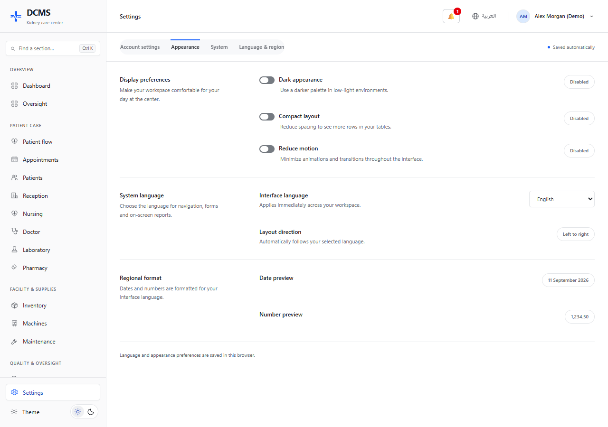
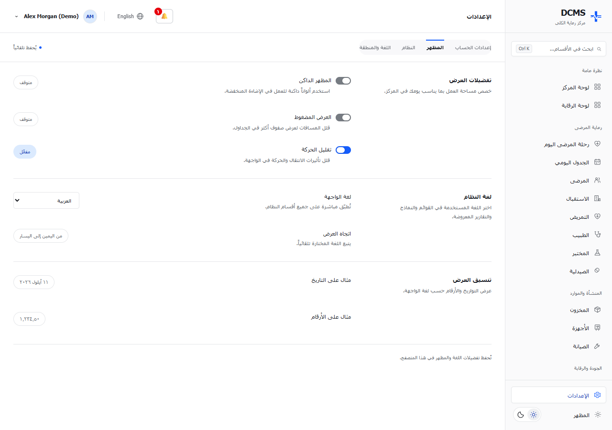
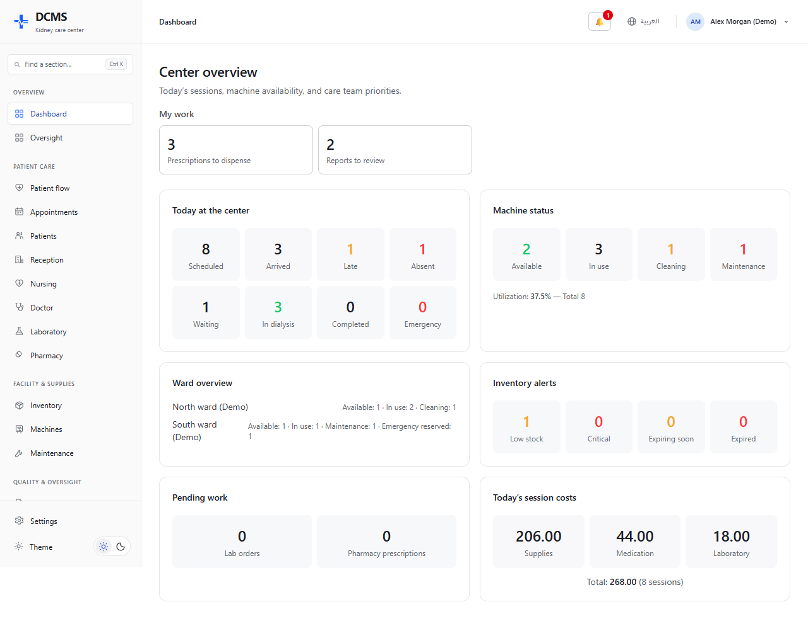
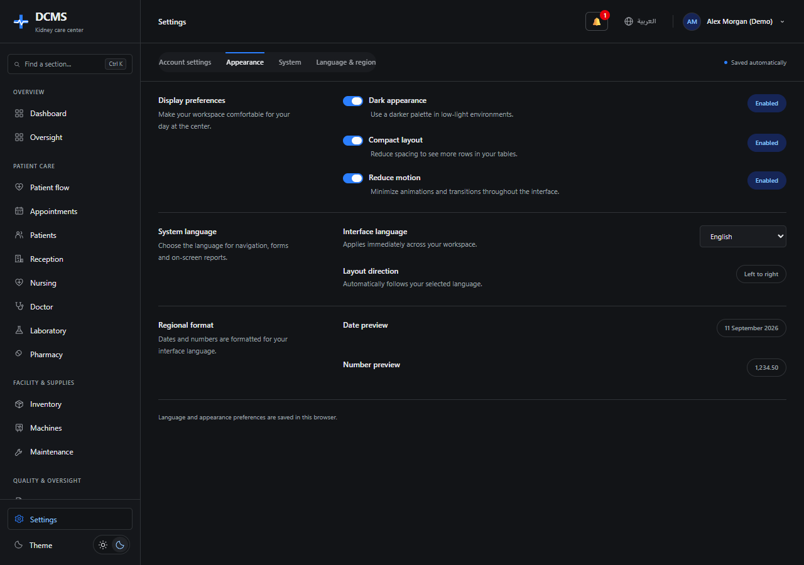
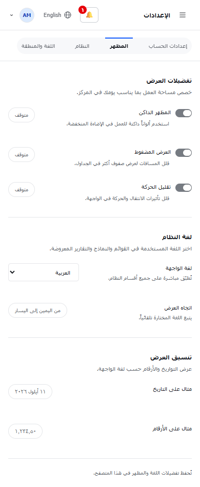

# تحديث الواجهة وإضافة الإنكليزية

تاريخ التحقق: 11 أيلول 2026.

تم تحديث الواجهة اعتماداً على المرجع المرفق وسكيل HeroUI React، مع الحفاظ على هيكل الأقسام ووظائفها وصلاحيات الوصول.

## التغييرات

- قائمة جانبية ثابتة، بحث بأسماء الأقسام، مجموعات للرعاية الصحية وإدارة المركز، وإعدادات المظهر أسفل القائمة.
- رأس صفحة بسيط يتضمن اسم القسم، تبديل اللغة، وقائمة الحساب.
- خلفيات فاتحة، فواصل رفيعة، لون أزرق للإجراءات، وتنسيق موحد للجداول والنماذج.
- تحديث تسجيل الدخول ولوحة المركز بمكونات HeroUI v3، وإضافة صفحة إعدادات بتبويبات ومفاتيح تبديل فعلية.
- دعم العربية والإنكليزية في الصفحات الإدارية الحالية وعددها 17، فضلاً عن تسجيل الدخول وصفحة الإعدادات الجديدة. تشمل الترجمة العناوين والحقول والحالات والتنبيهات والنصوص المساعدة.
- ضبط `lang` و`dir`، وعكس تخطيط القائمة بالعربية، وتنسيق التواريخ والأرقام حسب اللغة. تبقى بيانات المرضى وأسماء المستخدمين كما أدخلت.
- حفظ اللغة والمظهر الداكن وكثافة العرض وتقليل الحركة في Cookies خاصة بالتفضيلات. يقرأ الخادم التفضيلات عند فتح الصفحة، ويعمل التبديل دون إعادة تحميل النموذج.
- دعم الشاشات الصغيرة والقائمة القابلة للفتح، وربط حقول إضافة المريض الخمسة عشر بتسمياتها.

## التحقق

نجح بناء الويب عبر `npm run build:web` وفحص TypeScript. نجحت اختبارات المتصفح الستة عبر `npm run test:ui --workspace=@dcms/web`:

1. تبديل لغة تسجيل الدخول ورسالة الخطأ مع الاحتفاظ ببيانات الحقول.
2. استمرار اللغة والمظهر وكثافة العرض وتقليل الحركة بعد تحديث الصفحة، وعمل التبديل بالفأرة ولوحة المفاتيح.
3. الاحتفاظ بقيم نموذج المريض عند تغيير اللغة، وإرسال قيمة الجنس `FEMALE` والتاريخ كما هي إلى الخادم التجريبي.
4. البحث في القائمة وفتح الأقسام الرئيسية الاثني عشر بالإنكليزية دون أخطاء JavaScript أو تجاوز عرض شاشة سطح المكتب.
5. الإعدادات والتنقل بالعربية والإنكليزية على عرض 390 بكسل، دون تمرير أفقي للصفحة.
6. ظهور الأقسام وفق صلاحيات حساب محدود.

أكدت المراجعة أن 115 استدعاء API و58 استدعاء متعلقاً بالإرسال و248 خاصية للحقول ضمن الصفحات الأصلية بقيت كما كانت. نُقلت تسميات 52 حدثاً زمنياً إلى ملف مشترك بين ملف المريض وصفحة الطبيب.

استخدمت اختبارات المتصفح خادماً محلياً ببيانات مصطنعة بالكامل؛ لا تتصل الاختبارات بقاعدة بيانات المرضى. تثبت هذه الاختبارات سلوك الواجهة، ولا تستبدل اختبار العمليات السريرية على API الحقيقي. تظل ملفات PDF وExcel المُنشأة من الخادم خاضعة لتنسيق الخادم الحالي.

يوجد تحذير سابق من Next.js حول اسم `middleware.ts` واستبداله مستقبلاً بـ `proxy.ts`؛ لم يمنع البناء.

## المعاينة والاختبارات

تشغيل الاختبارات من جذر المشروع:

```sh
npm run test:ui --workspace=@dcms/web
```

يشغّل إعداد Playwright خادم بيانات تجريبي على `127.0.0.1:3101` وواجهة على `127.0.0.1:3100`. يعتمد على Edge في Windows، أو Chromium المثبت لـ Playwright في الأنظمة الأخرى. يمكن اختيار متصفح مثبت عبر `PLAYWRIGHT_CHANNEL`. في بيئة جديدة يمكن تثبيت Chromium بواسطة `npx playwright install chromium`.

للمعاينة اليدوية، شغّل `node scripts/ui-preview-api.mjs` ثم شغّل الويب على المنفذ 3100 مع `NEXT_PUBLIC_API_URL=http://127.0.0.1:3101/api/v2`. اسم المستخدم وكلمة المرور التجريبيان هما `fixture`؛ هذا الحساب خاص بالخادم التجريبي فقط. تستعمل التشغيلات الاعتيادية إعداد API الحالي للمشروع.

نتائج الاختبارات التفصيلية في `apps/web/test-results/results.json` بعد التنفيذ.










